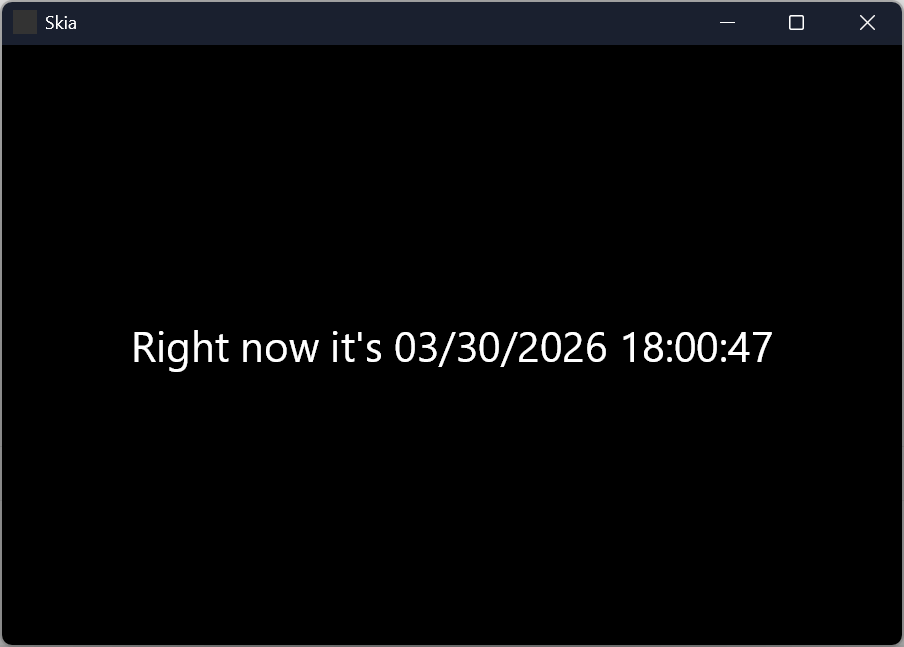
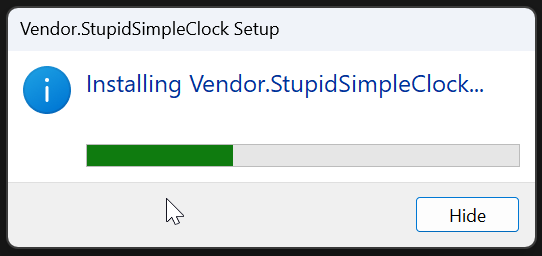

# StupidSimpleClock

Just a test vvvv app to play with [Velopack](https://velopack.io/)'s auto installer and auto updates

<p align="center">

</p>

## Steps

### Auto installer

- Reference `Velopack` in your Document
- Create an `IStartup` calling `VelopackApp.Build().Run();` in `Configure`
- I added `PublishShingFile` to the `.props` but that's up to you I guess
- Compile your patch (here the app will end up in `build/StupidSimpleClock`)
- Install the `vpk` tool using `dotnet tool install -g vpk`
- `cd` inside `/build` and run
```
vpk pack --packId Vendor.StupidSimpleClock --packVersion 1.0.0 --packDir ./StupidSimpleClock --mainExe StupidSimpleClock.exe
```
- You'll get a vvvvery beautiful output
```
 build  vpk pack --packId Vendor.StupidSimpleClock --packVersion 1.0.0 --packDir ./StupidSimpleClock --mainExe StupidSimpleClock.exe
[18:09:25 INF] Velopack CLI 0.0.1298, for distributing applications.
[18:09:25 INF] Beginning to package Velopack release 1.0.0.
[18:09:25 INF] Releases Directory: D:\Documents\dev\apps\StupidSimpleClock\build\Releases
[18:09:25 WRN]
    VelopackApp.Run() was found in method '_StupidSimpleClock_.Main.Startup_C
    _StupidSimpleClock_.Main.Startup_C::Configure_(VL.Core.AppHost)', which does not look like your application's entry
    point. It is strongly recommended that you move this to the very beginning of your Main() method.
[18:09:26 WRN] No signing parameters provided, 13 file(s) will not be signed.
[18:09:31 WRN] No signing parameters provided, 1 file(s) will not be signed.

          Pre-process steps ---------------------------------------- 100% 00:00:01
      Code-sign application ----------------------------------------   0% 00:00:00
  Building portable package ---------------------------------------- 100% 00:00:04
     Building release 1.0.0 ---------------------------------------- 100% 00:00:04
     Building setup package ---------------------------------------- 100% 00:00:00
         Post-process steps ---------------------------------------- 100% 00:00:00

[18:09:31 INF] Finished in 00:00:06.5533591.
```
- And you'll get a brand new `/Releases` folder with the following
```
Mode                LastWriteTime         Length Name
----                -------------         ------ ----
-a----        3/30/2026   6:09 PM            244   assets.win.json
-a----        3/30/2026   6:09 PM             94   RELEASES
-a----        3/30/2026   6:09 PM            282   releases.win.json
-a----        3/30/2026   6:09 PM       80955216   Vendor.StupidSimpleClock-1.0.0-full.nupkg
-a----        3/30/2026   6:09 PM       80954234   Vendor.StupidSimpleClock-win-Portable.zip
-a----        3/30/2026   6:09 PM       83537232 󰣆  Vendor.StupidSimpleClock-win-Setup.exe
```
- `Vendor.StupidSimpleClock-win-Setup.exe` will run a super minimal installer that indeed installs the app

<p align="center">

</p>